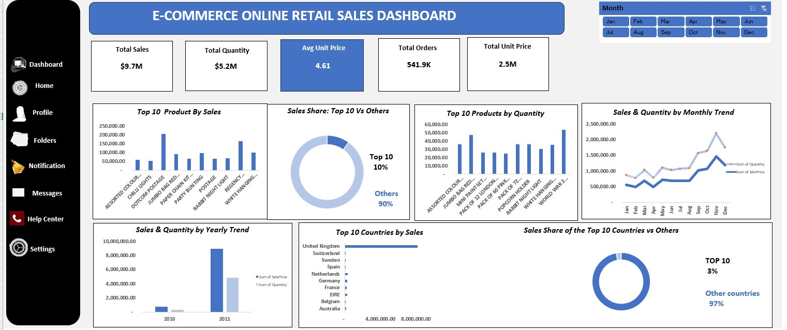
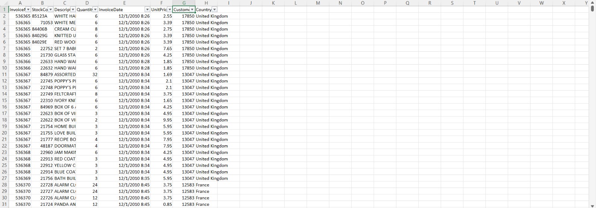
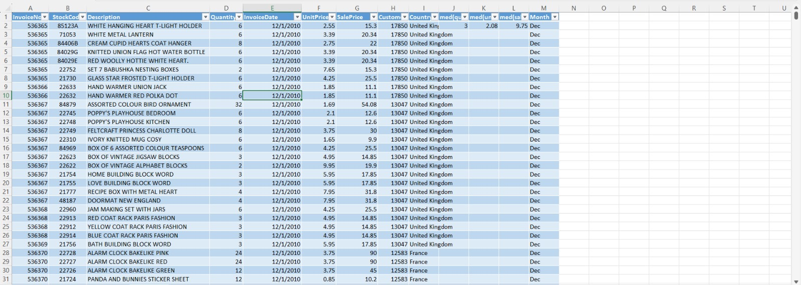

# E-commerce_OnlineRetail
🛒 E-Commerce Online Retail Sales Dashboard

📌 Project Overview
This project analyzes an online retail e-commerce dataset to uncover sales trends, top-performing products, customer distribution by country, and revenue patterns over time. The final output is an interactive Excel dashboard with monthly filtering capabilities.
Key metrics at a glance:
	•	💰 $9.7M Total Sales
	•	📦 $5.2M Total Quantity
	•	🧾 541.9K Total Orders
	•	💲 4.61 Average Unit Price
	•	🏷️ 2.5M Total Unit Price
  🧹 Data Cleaning Process
   

  
The raw dataset required significant cleaning before analysis. Here’s a full breakdown of every step taken:
1. Removed Duplicate Records
	•	Identified and removed duplicate rows based on InvoiceNo, StockCode, and InvoiceDate combinations to ensure each transaction was counted only once.
2. Handled Missing Values
	•	CustomerID: A significant number of rows had no CustomerID. These were retained for product/sales analysis but excluded from customer-level analysis.
	•	Description: Rows with blank product descriptions were removed as they could not be meaningfully analyzed.
3. Removed Cancelled Orders
	•	Invoices beginning with “C” (e.g., C536379) indicate cancellations/returns. These were filtered out to ensure only completed sales were included in the analysis.
4. Removed Negative & Zero Values
	•	Rows with negative Quantity values (returns/refunds) were excluded.
	•	Rows with zero or negative UnitPrice were removed as they represent data entry errors or free items that would distort revenue calculations.
5. Created a SalePrice Column
	•	A new SalePrice column was calculated:
•	This became the primary revenue metric used throughout the dashboard.
6. Extracted Date Components
	•	The InvoiceDate column contained both date and time. These were separated:
	•	Date extracted for daily/monthly analysis
	•	Month name extracted into a new Month column to power the monthly slicer on the dashboard
7. Added Statistical Reference Columns
	•	Calculated and added reference columns for deeper analysis:
	•	med(qu) — Median Quantity (3)
	•	med(un) — Median UnitPrice (2.08)
	•	med(sal) — Median SalePrice (9.75)
8. Standardized Text Fields
	•	Trimmed leading/trailing whitespace from Description and Country fields.
	•	Standardized country names for consistency (e.g., “EIRE” retained as the official name for Ireland in the dataset).
💡 Key Insights
	•	United Kingdom dominates sales by a massive margin, accounting for the vast majority of all revenue — other countries each represent a very small slice.
	•	The Top 10 products account for only 10% of total sales, meaning the catalog is extremely diverse with no single product driving the business.
	•	Sales show a strong upward trend from January through November, with a peak in November before dropping in December.
	•	2011 saw dramatically higher sales than 2010, suggesting strong business growth year-over-year.
	•	The average unit price is just £4.61, confirming this is a low-cost, high-volume retail operation.
	•	Assorted Colour Bird Ornament and Jumbo Bag Red Retrospot are among the top sellers by both sales and quantity.

🛠️ Tools & Technologies
	•	Microsoft Excel — Data cleaning, pivot tables, and dashboard design
	•	Dataset Source — UCI Machine Learning Repository / Kaggle (Online Retail Dataset)
